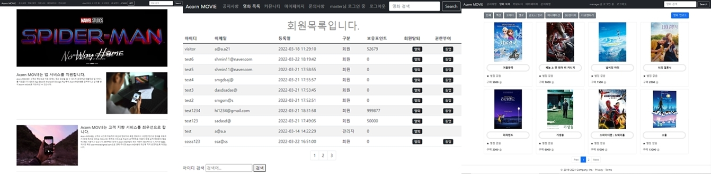
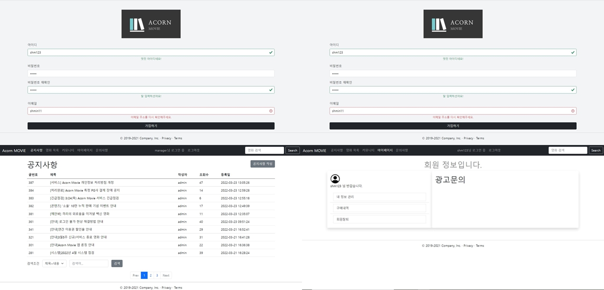
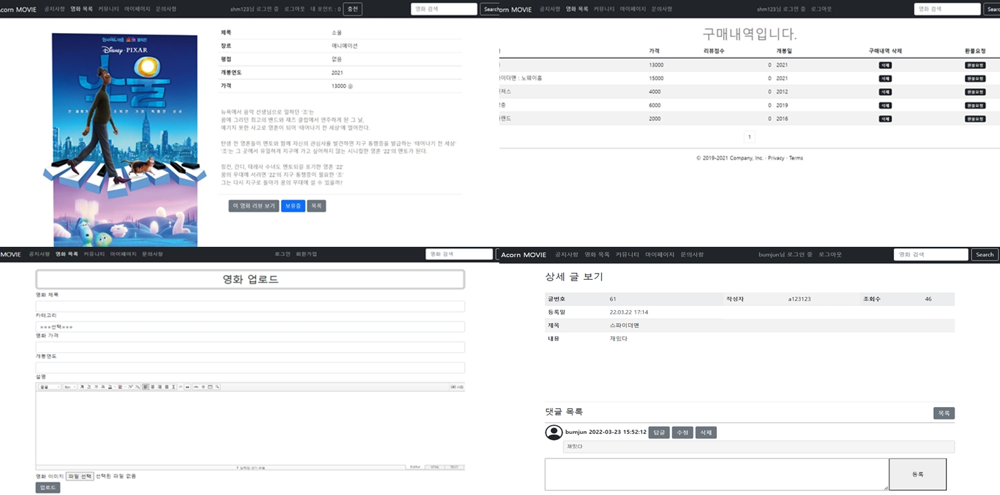
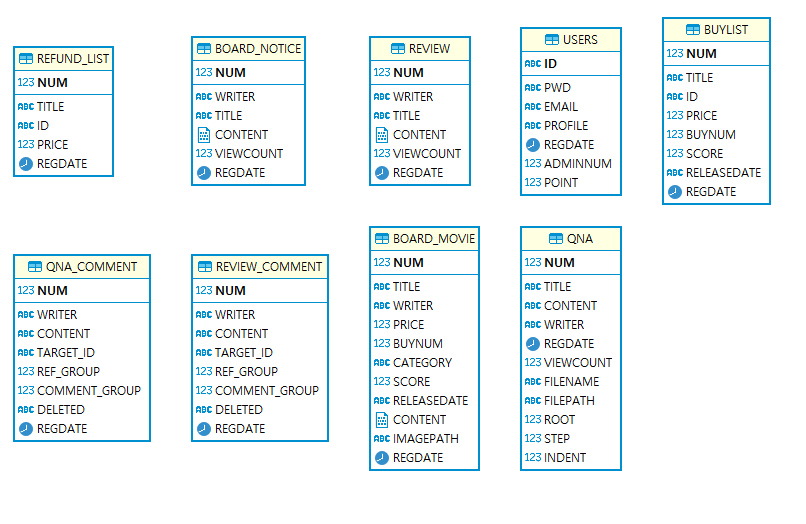

# :pencil: Acorn MOVIE 
>영화 구매 사이트

<b>프로젝트 사진</b>

 

## 1. 개요
배운 내용을 바탕으로 응용하여 로그인, 게시판, 구매, 환불요청, 마이페이지, 포인트, 관리자 기능 등을 구현한 영화 구매 사이트

 

## 2. 제작 기간 & 참여 인원
- 2022년 03월 02일 ~ 2022년 03월 24일
- 팀 프로젝트 6명. 전반적인 디자인, 회원가입, 로그인, 로그아웃 로직 담당

 

## 3. 사용 기술
#### `Back-end`
  - Java 8
  - SpringFramework 4
  - Mybatis
  - JSP
  - Oracle

 

## 4. DB 테이블

 

## 5. 핵심 기능
 * 서블릿 필터와 세션을 통한 로그인 사용자 Login 인증 정보 확인.
 * 관리자 권한이면 특정 게시판 글 작성 혹은 특정 회원탈퇴 및 권한 변경 가능.
 * 포인트로 구매, 환불 기능 구현.
 * 글 작성자가 동일할 경우 수정 및 삭제 가능.

<b>핵심 기능 설명 펼치기</b>

### 1. 서블릿 필터와 세션을 통한 로그인 사용자 Login 인증 정보 확인.
- **LoginFilter** :pencil: [코드 확인](https://github.com/HyoungMinSong/mall2/blob/4f64d0a3d2216b61bde38b5d77807a4bbba52c54/mall1/src/main/java/com/gura/spring/filter/LoginFilter.java#L27)
  - 필터와 세션을 통해 로그인 여부를 알아낸다. 
  - 로그인이 안되어 있으면 로그인 페이지로 리다이렉트 이동.
  - 로그인 페이지로 리다이렉트 이동이 되었으면 원래 가려던 목적지로 다시 갈 수 있도록 URL과 파라미터 정보를 가져온다.
  
 

### 2. 관리자 권한이면 특정 게시판 글 작성 혹은 특정 회원탈퇴 및 권한 변경 가능.
- **adminNum** :pencil: [코드 확인](https://github.com/HyoungMinSong/mall2/blob/4f64d0a3d2216b61bde38b5d77807a4bbba52c54/mall1/src/main/java/com/gura/spring/movie/service/MovieServiceImpl.java#L130)
  - USERS 테이블의 adminNum 칼럼의 값 0 혹은 1을 통해서 관리자와 유저를 구분한다.
  - adminNum이 1인 경우 영화 업로드와 수정 삭제 버튼이 활성화. 스마트에디터를 사용하여 영화 정보와 사진을 업로드 할 수 있다.

 

- **관리자 기능**
  - 마찬가지로 adminNum을 통해 회원들의 목록을 살펴볼 수 있고 회원 탈퇴 및 권한을 변경할 수 있다.
 
 

### 3. 포인트로 구매, 환불 기능 구현
- **영화 구매** 
  - 영화 구매시 USERS 테이블에서 로그인된 Id의 Point가 영화의 가격만큼 차감된다. 

 

- **영화 환불** :pencil: [코드 확인](https://github.com/HyoungMinSong/mall2/blob/4f64d0a3d2216b61bde38b5d77807a4bbba52c54/mall1/src/main/java/com/gura/spring/buy/service/BuyServiceImpl.java#L137)
  - 포인트를 다시 돌려주는 방식으로 진행.
  - 환불요청을 완료하면 일반회원의 구매내역에서 지워진다. 마찬가지로 환불요청 리스트에서도 동시에 지워진다.

 

### 4. 글 작성자가 동일할 경우 수정 및 삭제 가능
- **수정 및 삭제** :pencil: [코드 확인](https://github.com/HyoungMinSong/mall2/blob/4f64d0a3d2216b61bde38b5d77807a4bbba52c54/mall1/src/main/java/com/gura/spring/qna/service/QnaServiceImpl.java#L239)
  - 세션 아이디와 작성자의 아이디가 다르다면 예외를 발생시키도록 만든다.

 

## 6. 트러블 슈팅

 특정 페이지 접근 불가 오류 

  - 에러
    - 특정 페이지의 404 오류.
  - 해결
    - Web Modules의 path 변경으로 해결.

 DB 연결 오류 

  
  - 에러
    - 깃허브에 새로 풀된 프로젝트를 구동 중 DB 연결 오류 발생.
  - 해결
    -  머지 충돌 중 맵퍼 삭제 발생. 맵퍼 복구 후 해결.
  

 이클립스 Import Project 오류

  
  - 에러 메세지
    - a .project file already exists in directory
  - 해결
    - 이클립스와 STS의 메타 데이터의 문제
    - 깃 레포지토리에 들어있는 디렉토리 프로젝트 오른쪽 클릭 후 나오는 Import Projects를 클릭 후 진행.
  

